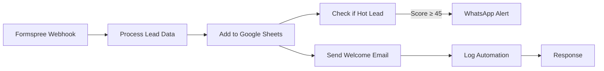

# 📧 Sistema de Automatización de Emails - ALENIA

## 🎯 Overview

Sistema de captura y automatización de leads implementado con **N8N** para el proyecto ALENIA. Automatiza la captura de leads desde formularios web y envía emails de bienvenida personalizados con la identidad visual de la marca.

## 🔧 Componentes del Sistema

### **Workflow Principal: ALENIA_CRM_AUTOMATIZATION**
- **ID**: `99of6SJ5ZsE1Vfx8`
- **Estado**: ✅ Activo
- **Webhook**: `/alenia-leads`

### **Flujo de Automatización**



## 📊 Sistema de Scoring Inteligente

### **Algoritmo de Puntuación (Base: 20 puntos)**

```javascript
// Score por industria/rubro
ecommerce/online → +25 puntos
retail/tienda → +15 puntos  
servicios/consultora → +20 puntos
restaurante/comida → +10 puntos
salud/clínica → +15 puntos
tecnología/software → +30 puntos

// Score por email
.com.ar/.ar → +10 puntos
Email corporativo → +15 puntos
Gmail → +5 puntos

// Score por completitud
Empresa completa → +10 puntos
Teléfono válido → +8 puntos
Cargo especificado → +5 puntos
Presupuesto indicado → +12 puntos

// Score por timing
Horario comercial (9-18h) → +10 puntos
Horario nocturno (19-22h) → +5 puntos
```

### **Clasificación de Leads**
- **🔥 Hot Lead (≥45 puntos)**: Activación automática de WhatsApp alert
- **❄️ Normal Lead (<45 puntos)**: Solo email de bienvenida

## 📧 Email de Bienvenida

### **Características del Template**
- **Identidad Visual**: Gradiente púrpura-magenta oficial de ALENIA
- **Logo**: Red neuronal CSS con colores verde-cyan-azul
- **Responsive**: Optimizado para móviles y desktop
- **Personalización**: Usa `{{ $json.NOMBRE }}` para personalizar

### **Contenido Estratégico**
1. **Badge de Acceso Exclusivo**
2. **Presentación de la empresa** (quiénes somos, qué hacemos, qué buscamos)
3. **Ventajas del Early Access** (48 horas antes del lanzamiento)
4. **Mensaje personal del fundador**
5. **Call-to-action** para responder dudas

### **Configuración de Email**
```
From: noreply@alenia.online
To: {{ $json.EMAIL }}
Subject: 🚀 Acceso Exclusivo Confirmado - ALENIA
```

## 🗃️ Estructura de Datos

### **Campos Capturados**
```json
{
  "ID": "timestamp_unico",
  "FECHA": "DD/MM/YYYY",
  "NOMBRE": "string",
  "APELLIDO": "string", 
  "EMAIL": "email_valido",
  "TELEFONO": "string",
  "EMPRESA": "string",
  "CARGO": "string",
  "INDUSTRIA": "string",
  "FUENTE": "landing-web",
  "ESTADO": "Nuevo",
  "SCORE": "numero_0_100",
  "PRESUPUESTO": "string",
  "NOTAS": "descriptivo_automatico",
  "PROXIMO_CONTACTO": "fecha_+2_dias",
  "hot_lead": "boolean",
  "early_access": true
}
```

## 📱 Alertas WhatsApp (Hot Leads)

### **Trigger**: Score ≥ 45 puntos
### **Mensaje Template**:
```
🔥 HOT LEAD ALENIA DETECTADO! 🔥

👤 Nombre: {{ NOMBRE }}
📧 Email: {{ EMAIL }}
🏢 Empresa: {{ EMPRESA }}
🎯 Industria: {{ INDUSTRIA }}
⭐ Score: {{ SCORE }}/100
📅 Fecha: {{ FECHA }}
💰 Presupuesto: {{ PRESUPUESTO }}
📍 Fuente: {{ FUENTE }}

🚨 ACCIÓN URGENTE:
Contactar en las próximas 2 horas para maximizar conversión.

🚀 ALENIA - Early Access Lead Management
```

## 🔧 Configuración Técnica

### **Credenciales Necesarias**
1. **Google Sheets OAuth2** para almacenamiento de leads
2. **SMTP Credentials** para envío de emails
3. **WhatsApp Business API** (opcional, para alertas)

### **Variables de Entorno**
```
GOOGLE_SHEETS_ID=tu_spreadsheet_id
SMTP_HOST=smtp.gmail.com
SMTP_PORT=587
SMTP_USER=tu_email@gmail.com
SMTP_PASS=tu_app_password
```

### **Manejo de Errores**
- **Try/Catch** completo en procesamiento de datos
- **Validación** de email obligatorio
- **Valores por defecto** para campos opcionales
- **Logging detallado** para debugging

## 📈 Métricas y Logging

### **Logs Automáticos**
- Todos los leads se registran en hoja `AUTOMATIZACION_LOG`
- Timestamp de envío de emails
- Errores capturados y documentados
- Métricas de scoring por lead

### **KPIs Monitoreados**
- **Tasa de conversión** por fuente
- **Score promedio** de leads
- **Tiempo de respuesta** del workflow
- **Rate de emails entregados** exitosamente

## 🧪 Testing y Validación

### **Test de Webhook**
```bash
curl -X POST https://tu-n8n-url/webhook/alenia-leads \
  -H "Content-Type: application/json" \
  -d '{
    "nombre": "Juan Pérez",
    "email": "juan@empresa.com",
    "empresa": "Mi Empresa SRL",
    "rubro": "ecommerce",
    "telefono": "+5491123456789"
  }'
```

### **Validación de Funcionamiento**
1. ✅ **Webhook recibe datos** correctamente
2. ✅ **Scoring se calcula** según algoritmo
3. ✅ **Email se envía** con template correcto
4. ✅ **Datos se guardan** en Google Sheets
5. ✅ **Hot leads** activan WhatsApp alert

## 🚀 Próximas Mejoras

### **Fase 2 - Secuencias Avanzadas**
- **Email nurturing** automático (7 emails en 14 días)
- **Segmentación** por industria
- **A/B testing** de subject lines
- **Reactivación** de leads fríos

### **Fase 3 - Inteligencia Avanzada**
- **Machine Learning** para scoring predictivo
- **Análisis de sentiment** en respuestas
- **Optimización automática** de horarios de envío
- **Personalización dinámica** de contenido

## 📞 Soporte y Mantenimiento

### **Monitoreo**
- **Dashboard N8N** para ejecuciones en tiempo real
- **Alertas** por fallos en el workflow
- **Backup automático** de configuraciones

### **Troubleshooting**
```javascript
// Verificar ejecuciones
GET /api/v1/executions

// Ver logs específicos
GET /api/v1/executions/{execution_id}

// Reactivar workflow
POST /api/v1/workflows/{workflow_id}/activate
```

## 📋 Checklist de Implementación

### **Configuración Inicial**
- [ ] ✅ Workflow creado y activo
- [ ] ✅ Credenciales SMTP configuradas
- [ ] ⚠️ Google Sheets ID real (pendiente)
- [ ] ⚠️ WhatsApp API configurada (opcional)

### **Testing**
- [ ] ✅ Email template con identidad ALENIA
- [ ] ✅ Sistema de scoring funcionando
- [ ] 🔄 Test de webhook end-to-end (pendiente)
- [ ] 🔄 Validación de entrega de emails (pendiente)

### **Documentación**
- [ ] ✅ Manual técnico completo
- [ ] ✅ Configuración de variables
- [ ] ✅ Troubleshooting guide
- [ ] ✅ Roadmap de mejoras

---

## 🎯 Estado Actual: LISTO PARA TESTING

**El sistema está configurado y activo. Próximo paso:**
1. **Reemplazar** Google Sheets ID con el real
2. **Probar** con lead de test
3. **Validar** recepción de email
4. **Verificar** almacenamiento en sheets

---

**ALENIA Email Automation System** - *Convertiendo leads en clientes desde el primer contacto* 🚀